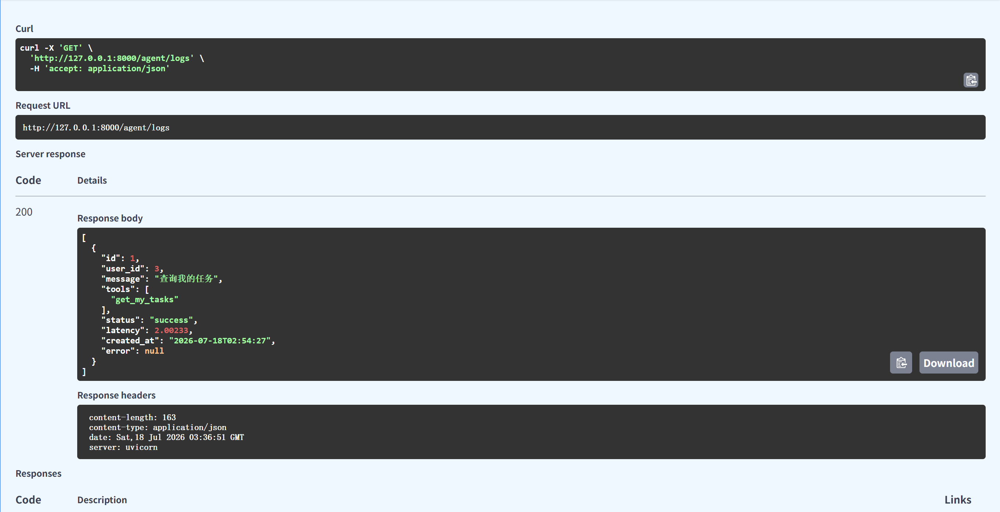
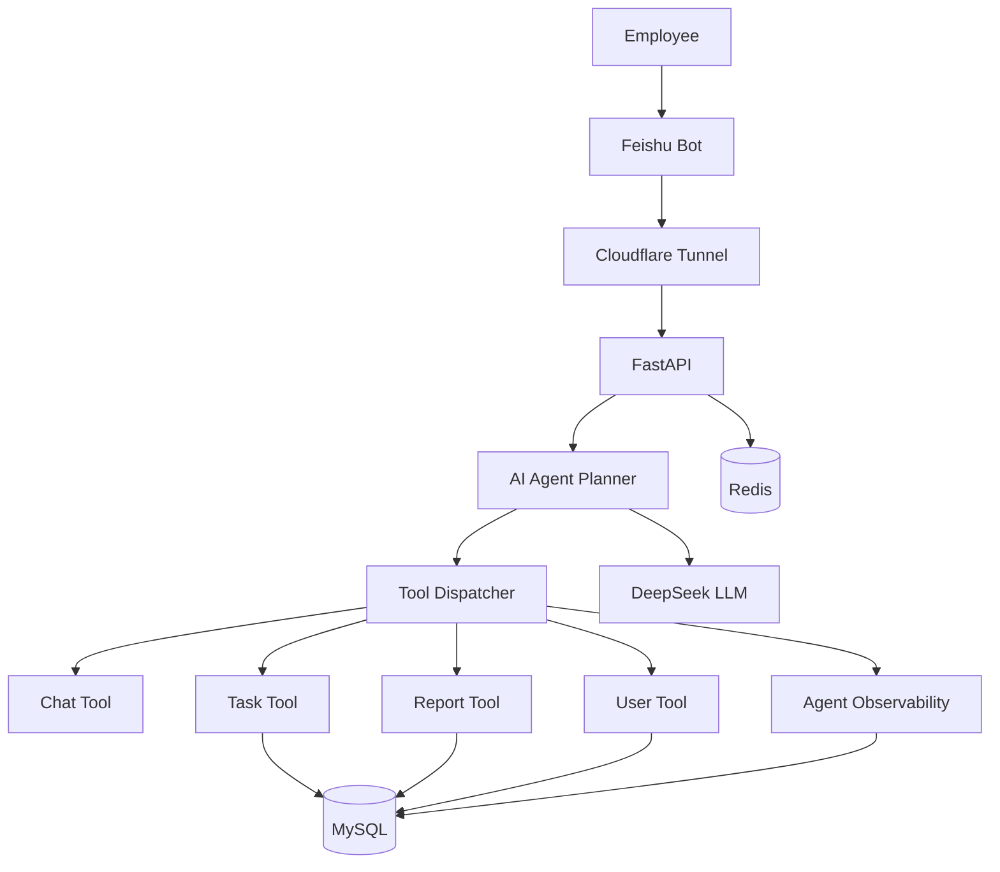

# Enterprise AI Assistant

<div align="center">

基于 **FastAPI + LLM Agent + Tool Calling + Feishu Bot** 的企业智能办公助手平台。

An AI-powered enterprise office assistant built with **FastAPI**, **LLM Agent**, **Tool Calling**, and **Feishu Bot**.

<br/>


</div>


---

# 项目介绍 | Introduction

## 中文介绍

Enterprise AI Assistant 是一个面向企业办公场景的智能 Agent 平台。

不同于传统 ChatBot 只能进行文本问答，本项目采用：

> **LLM Agent + Tool Calling + Business Service**

架构。


系统核心思想：

- LLM 负责理解用户自然语言需求
- Planner 负责生成任务执行计划
- Tool Dispatcher 负责选择业务工具
- Business Tool 执行业务操作
- Backend Service 完成数据库交互


目前支持：

- 企业任务管理
- AI 自动创建任务
- AI 修改任务
- AI 删除任务
- AI 查询任务
- AI 自动生成日报
- 用户信息查询
- 飞书机器人办公交互


员工可以直接通过飞书发送自然语言指令完成办公操作。


## English Introduction

Enterprise AI Assistant is an enterprise-oriented AI Agent platform.

Unlike traditional chatbots, this project uses an Agent-based architecture:

- LLM understands user intent
- Planner generates execution plans
- Tool Calling invokes business functions
- Backend services execute real operations


The system integrates with Feishu Bot, allowing employees to complete office operations through natural language.


---

# 项目展示 | Demonstration


## 飞书机器人交互 | Feishu Bot


---

## Swagger API


---

## Agent Observability

Agent execution trace monitoring.




---

## GitHub Actions CI


---

## Docker Deployment


---

## MySQL Database


---

## Project Structure


---

# 系统架构 | Architecture




---

# 核心功能 | Core Features


## AI Agent

系统采用 Agent 架构，通过 Planner + Tool Calling 实现多步骤任务执行。


功能包括：

- AI Planner
- Tool Calling
- Multi-step Tool Execution
- Conversation Memory
- Chat History
- Context-aware Interaction
- Agent Execution Trace


工作流程：

```
User Message

      ↓

LLM Planner

      ↓

Generate Execution Plan

      ↓

Tool Dispatcher

      ↓

Business Tools

      ↓

Database Operation

      ↓

LLM Summary

      ↓

Return Result
```


---

## 企业办公功能 | Enterprise Office


### 任务管理

支持通过自然语言管理企业任务：

- 创建任务
- 查询任务
- 修改任务
- 删除任务
- 设置任务优先级
- 查看任务状态


例如：

```
帮我创建一个高优先级任务

标题：完成项目部署

描述：完成 Docker 环境配置
```


AI Agent 会自动：

1. 理解用户意图
2. 调用 create_task Tool
3. 写入 MySQL
4. 返回执行结果


---

### AI 日报生成

支持根据用户任务自动生成日报。


流程：

```
查询今日任务

        ↓

Task Tool

        ↓

LLM Summary

        ↓

Generate Daily Report

        ↓

Save Database
```


---

### 用户管理

支持：

- 用户信息查询
- 飞书 OpenID 绑定
- 企业用户身份识别


---

# 飞书集成 | Feishu Integration


系统通过飞书机器人提供企业聊天入口。


支持：

- Feishu Bot
- Webhook Callback
- Event Subscription
- OpenID Binding
- Interactive Message Card
- Redis Message Deduplication


用户无需打开额外系统：

```
飞书聊天

↓

AI Agent

↓

业务系统
```


即可完成办公操作。


---

# Agent 可观测性 | Observability


为了方便调试和生产环境监控，系统增加 Agent Trace。


记录：

- 用户输入
- Agent Plan
- 调用 Tool
- 执行状态
- 响应耗时
- 异常信息


示例：

```json
{
    "message": "查询我的任务",
    "tools": [
        "get_my_tasks"
    ],
    "status": "success",
    "latency": 2.00
}
```


通过：

```
GET /agent/logs
```

查看 Agent 执行记录。


---

# 技术栈 | Technology Stack


| 分类 | 技术 |
|----|----|
| Backend | FastAPI |
| Language | Python 3.10 |
| AI Model | DeepSeek API |
| Agent Framework | Custom LLM Agent |
| Database | MySQL 8 |
| ORM | SQLAlchemy |
| Migration | Alembic |
| Cache | Redis |
| Bot | Feishu Open Platform |
| Deployment | Docker |
| CI/CD | GitHub Actions |
| Tunnel | Cloudflare Tunnel |


---

# 项目结构 | Project Structure


```text
Enterprise AI Assistant
│
├── app
│
│   ├── agent
│   │   ├── planner.py
│   │   ├── executor.py
│   │   ├── tools.py
│   │   └── registry.py
│   │
│   ├── api
│   │   ├── feishu.py
│   │   └── agent.py
│   │
│   ├── core
│   │
│   ├── crud
│   │
│   ├── db
│   │
│   ├── llm
│   │
│   ├── models
│   │
│   ├── schemas
│   │
│   └── services
│
├── alembic
│
├── docs
│   └── images
│
├── .github
│   └── workflows
│       └── ci.yml
│
├── docker-compose.yml
│
├── requirements.txt
│
└── README.md
```


---

# 快速启动 | Quick Start


## 1. Clone Repository


```bash
git clone https://github.com/fan70dev-bit/enterprise-ai-agent.git

cd enterprise-ai-agent
```


---

## 2. 安装依赖


```bash
pip install -r requirements.txt
```


---

## 3. 配置环境变量


复制：

```bash
cp .env.example .env
```


修改：

```env
MYSQL_HOST=localhost
MYSQL_PORT=13306

REDIS_HOST=localhost
REDIS_PORT=6379

DEEPSEEK_API_KEY=your_key

FEISHU_APP_ID=your_app_id

FEISHU_APP_SECRET=your_secret
```


---

## 4. 启动数据库


启动 MySQL 和 Redis：

```bash
docker compose up -d
```


查看：

```bash
docker ps
```


---

## 5. 数据库迁移


```bash
alembic upgrade head
```


---

## 6. 启动 FastAPI


```bash
source .venv/bin/activate


uvicorn app.main:app --reload
```


服务：

```
http://127.0.0.1:8000
```


---

## 7. 启动 Cloudflare Tunnel


```bash
cloudflared tunnel --url http://127.0.0.1:8000
```


用于：

- 飞书事件回调
- Webhook 调试


---

## 8. Swagger API


访问：

```
http://127.0.0.1:8000/docs
```


---

# 当前完成情况 | Current Features


- ✅ AI Agent
- ✅ Planner
- ✅ Tool Calling
- ✅ Multi-step Tool Execution
- ✅ Chat History
- ✅ Context Memory
- ✅ User Management
- ✅ Department Management
- ✅ Task CRUD
- ✅ AI Task Creation
- ✅ AI Task Update
- ✅ AI Task Delete
- ✅ AI Daily Report Generation
- ✅ Feishu Bot
- ✅ Interactive Card Messages
- ✅ Redis Message Deduplication
- ✅ Agent Observability
- ✅ Docker Deployment
- ✅ GitHub Actions CI


---

# 后续规划 | Roadmap


## 已完成

- [x] AI Agent
- [x] Tool Calling
- [x] Feishu Bot
- [x] Task Management
- [x] Daily Report
- [x] Chat History
- [x] Redis Deduplication
- [x] Docker Deployment
- [x] GitHub Actions CI
- [x] Agent Observability


## 计划


- [ ] Knowledge Base RAG
- [ ] MCP Integration
- [ ] Workflow Engine
- [ ] Permission Management
- [ ] Multi-Agent Collaboration
- [ ] Agent Evaluation System


---

# License


This project is intended for:

- Learning
- Portfolio Demonstration
- AI Agent Engineering Practice


