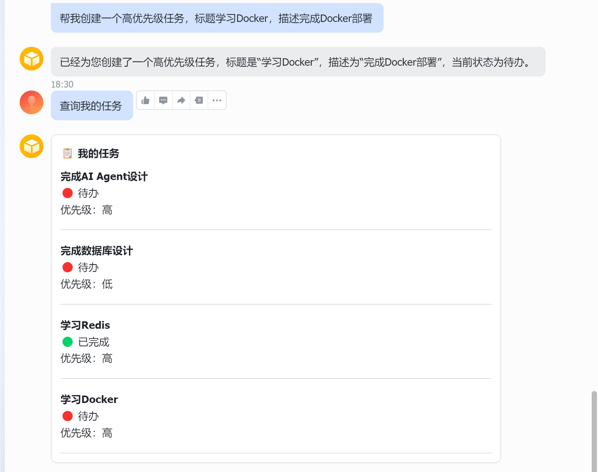
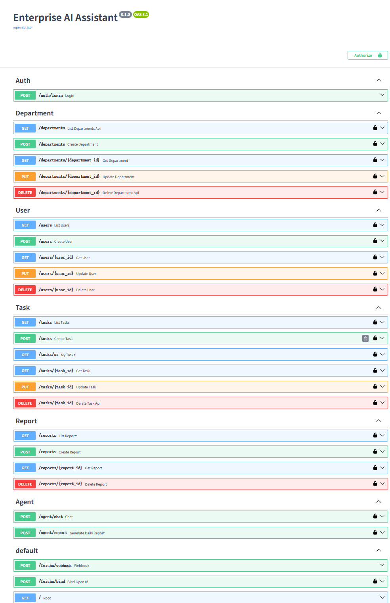
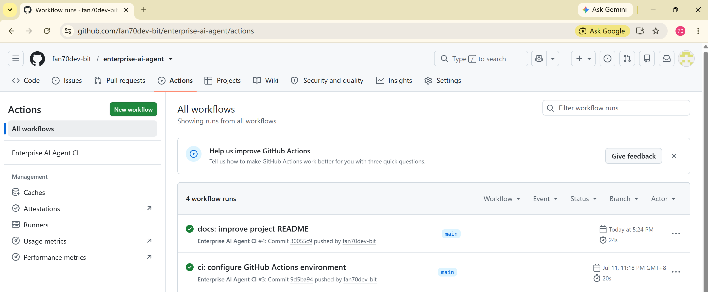
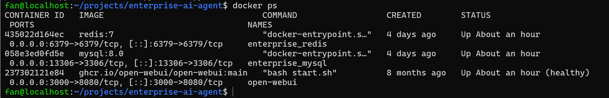
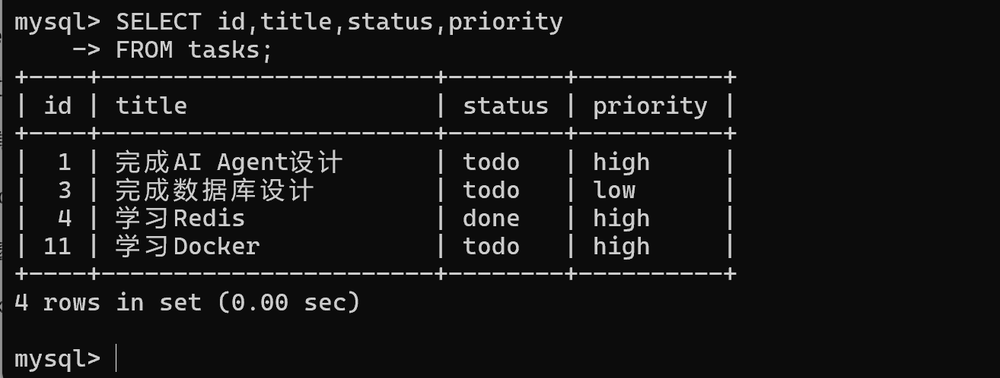
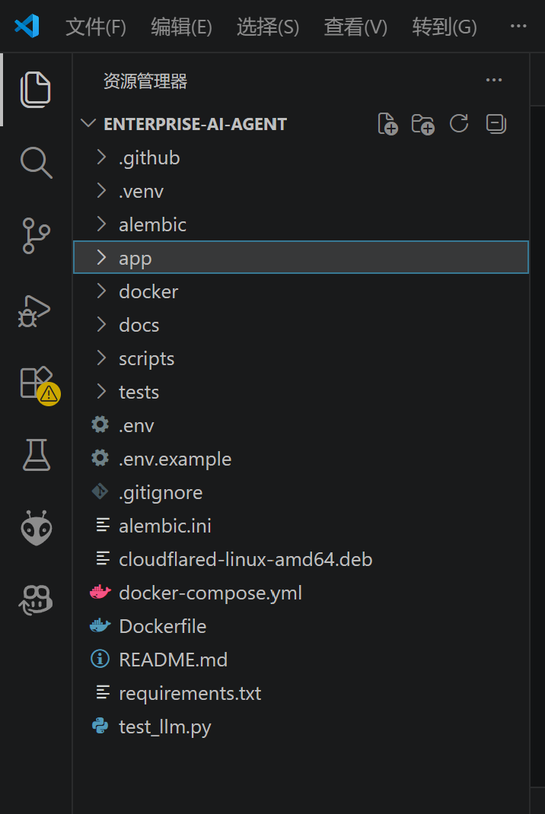
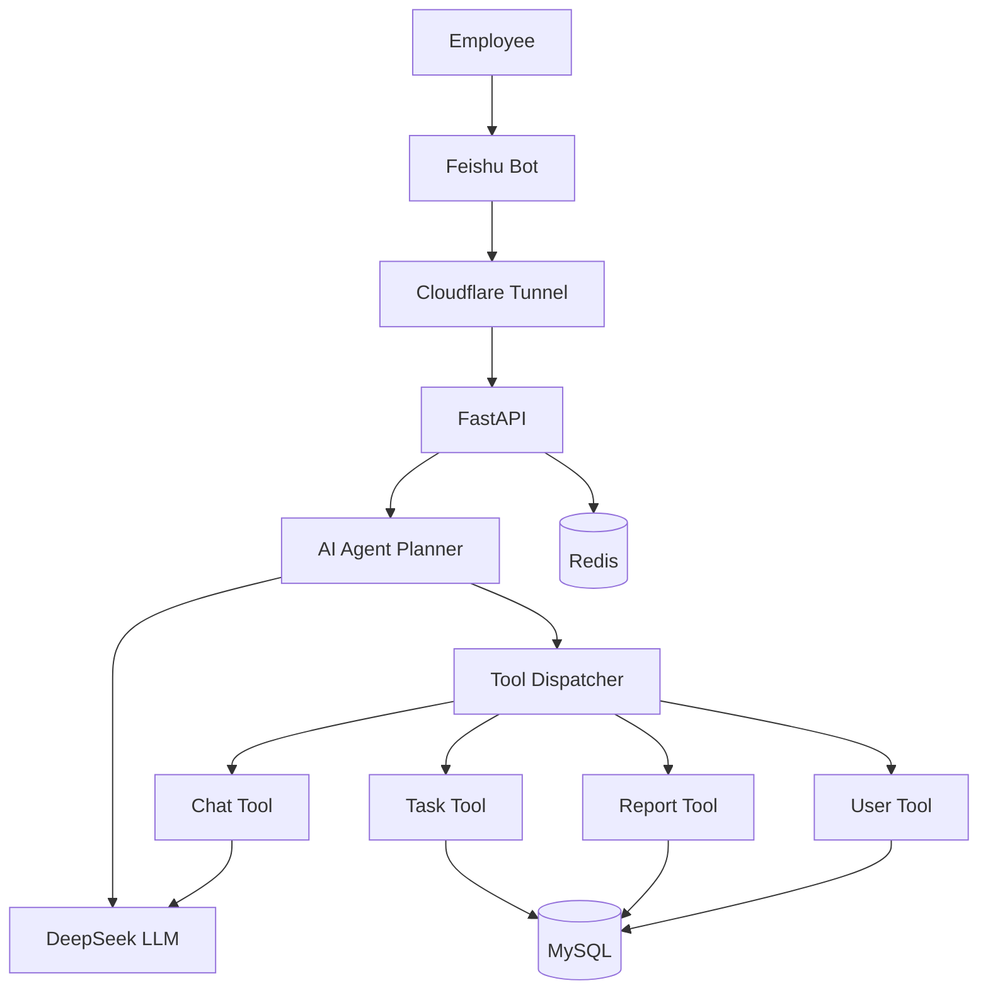

# Enterprise AI Assistant

<div align="center">

An AI-powered enterprise office assistant built with **FastAPI**, **LLM Agent**, **Tool Calling**, and **Feishu Bot**.


</div>

---

# Project Introduction

Enterprise AI Assistant is an AI-powered office automation platform designed for enterprise collaboration scenarios.

Unlike traditional chatbots, the system adopts an **AI Agent + Tool Calling** architecture. The Large Language Model (LLM) is responsible for understanding user intent, while specialized business tools execute real operations such as task management, report generation, and user information retrieval.

The project integrates with **Feishu Bot**, allowing employees to complete office tasks directly through natural language conversations.

---

# Project Demonstration

## Feishu Bot



---

## Swagger



---

## GitHub Actions



---

## Docker Deployment



---

## MySQL



---

## Project Structure



# System Architecture



---

# Core Features

## AI Agent

- AI Planner
- Tool Calling
- Multi-step Tool Execution
- Chat History
- Conversation Memory
- Context-aware Interaction

---

## Enterprise Office

- User Management
- Department Management
- Task Management
- AI Task Creation
- AI Task Update
- AI Task Deletion
- AI Task Query
- AI Daily Report Generation

---

## Feishu Integration

- Feishu Bot
- Webhook Callback
- OpenID Binding
- Interactive Task Cards
- Redis Message Deduplication

---

## Engineering

- FastAPI
- SQLAlchemy
- Alembic
- Docker
- GitHub Actions CI
- Swagger / OpenAPI

---

# Technology Stack

| Category | Technology |
|-----------|------------|
| Backend | FastAPI, Python |
| AI | DeepSeek API, AI Agent, Tool Calling |
| Database | MySQL |
| Cache | Redis |
| ORM | SQLAlchemy |
| Migration | Alembic |
| Bot | Feishu Open Platform |
| Deployment | Docker |
| CI/CD | GitHub Actions |
| Tunnel | Cloudflare Tunnel |

---

# Project Structure

```text
Enterprise AI Assistant
│
├── app
│   ├── agent
│   ├── api
│   ├── core
│   ├── crud
│   ├── db
│   ├── llm
│   ├── models
│   ├── schemas
│   ├── services
│   └── utils
│
├── alembic
│
├── .github
│   └── workflows
│       └── ci.yml
│
├── docker-compose.yml
│
├── requirements.txt
│
└── README.md
```

---

# Quick Start

## Clone Repository

```bash
git clone https://github.com/fan70dev-bit/enterprise-ai-agent.git

cd enterprise-ai-agent
```

---

## Install Dependencies

```bash
pip install -r requirements.txt
```

---

## Start MySQL & Redis

```bash
docker compose up -d
```

---

## Start FastAPI

```bash
source .venv/bin/activate

uvicorn app.main:app --reload
```

---

## Start Cloudflare Tunnel

```bash
cloudflared tunnel --url http://127.0.0.1:8000
```

---

## Open Swagger

```
http://127.0.0.1:8000/docs
```

---

# Current Features

- ✅ AI Agent
- ✅ Planner
- ✅ Tool Calling
- ✅ Multi-step Tool Execution
- ✅ Chat History
- ✅ Context Memory
- ✅ User Management
- ✅ Department Management
- ✅ Task CRUD
- ✅ Daily Report Generation
- ✅ Feishu Bot
- ✅ Interactive Card Messages
- ✅ Redis Message Deduplication
- ✅ Docker Deployment
- ✅ GitHub Actions CI

---

# Roadmap

- [x] AI Agent
- [x] Tool Calling
- [x] Feishu Bot
- [x] Task Management
- [x] Daily Report
- [x] Chat History
- [x] Redis Message Deduplication
- [x] Docker Deployment
- [x] GitHub Actions CI
- [ ] Knowledge Base (RAG)
- [ ] MCP Integration
- [ ] Workflow Engine

---

# License

This project is intended for learning, portfolio demonstration, and AI Agent development practice.
